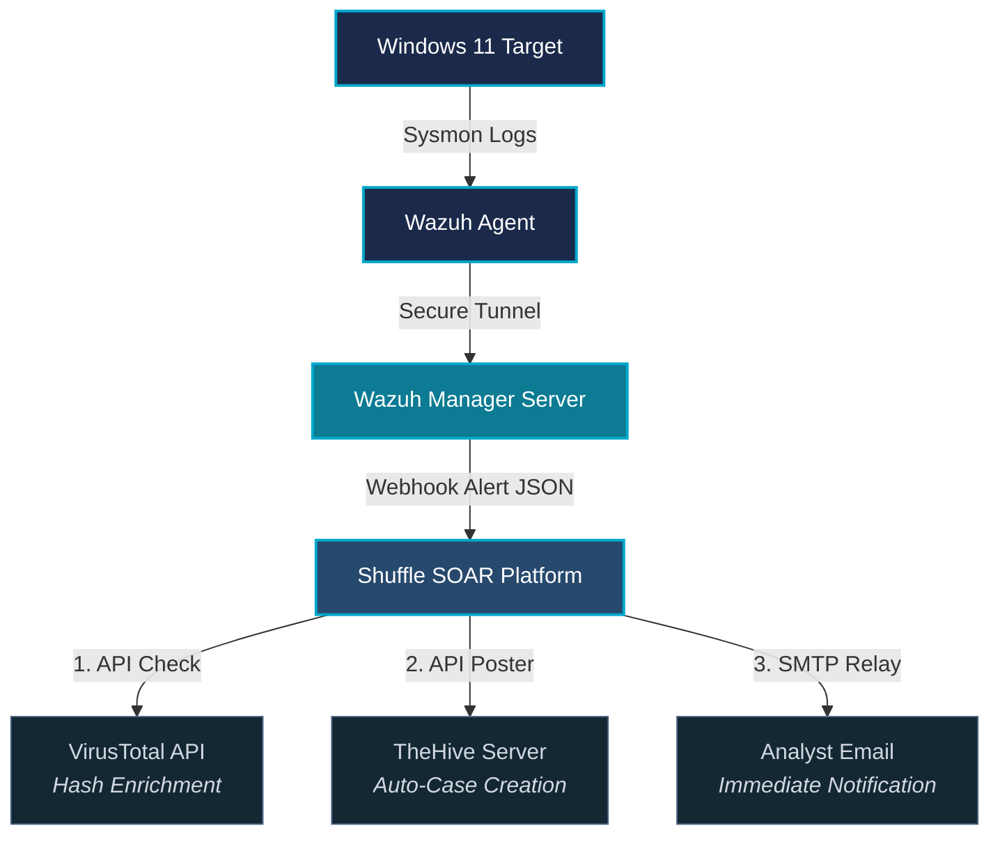

# SOC-Automation-Homelab

## Overview
Built a cloud-hosted, automated incident response environment designed to ingest endpoint telemetry, trigger high-fidelity alerts for credential dumping, orchestrate threat intelligence enrichment via VirusTotal, auto-generate tickets in a case management platform, and alert analysts instantly via email.

## Architectural Diagram & Workflow

## Demo
[Watch the SOC Automation Demo](https://www.youtube.com/watch?v=41O4c81t-5U)

